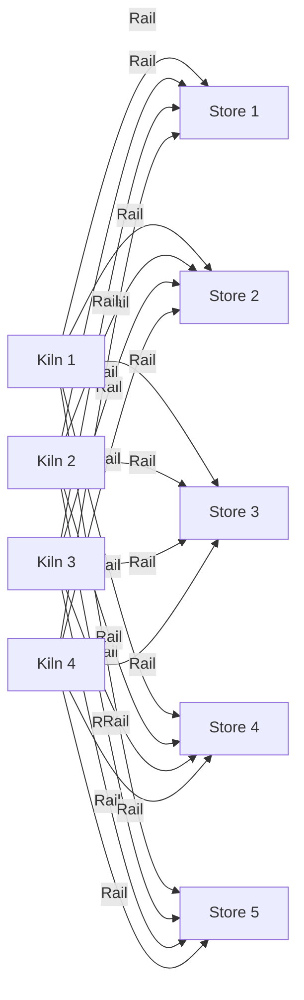
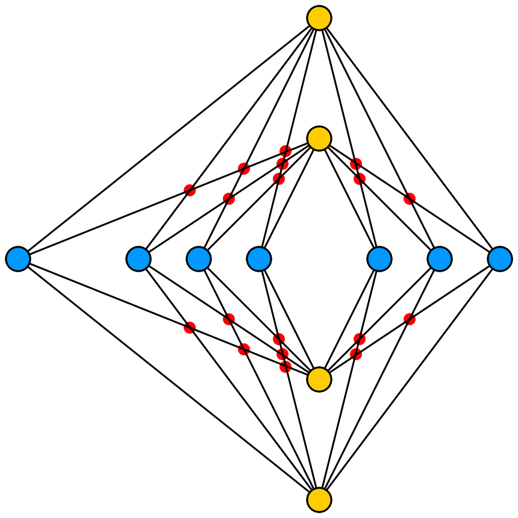

# **Digital Engineering Symbols**

## **What is a symbol**

In this document we intend for `symbol` to be interpreted as an artifact intended to be represent physical engineering objects in digital drawing surfaces and presentation surfaces.

### **A Valve**

When a designer does layout and design of a diagram by hand they solve a variant of the [Brick factory problem](https://en.wikipedia.org/wiki/Tur%C3%A1n%27s_brick_factory_problem), often by hand every time a significant change has been made to the system the diagram is a representation of.

This process is costly both in effort and time. This can be remedied by either reducing the reliance on the diagram or increasing the rate of which the diagrams can be produced without similarly increasing cost of production.

We have identified two likely candidates for improvement, layout and recognizable visual representations.

In order to deliver machine assisted layout of the complex graphs that are represented in technical diagrams we need to narrow the space of potential solutions for layouts.

In order for the symbols the function as at least a supplement to the current representation on physical paper they need to be rendered in a predictable way ensuring recognition and a feeling of familiarity for an established user to existing implementations (Both physical and digital).

Resulting in the following list of requirements for a digital symbol:

-   **[Layout](#layout)**
    -   [Orientation](#Orientation)
    -   [Direction](#direction)
    -   [Ports](#ports)
-   **[Rendering](#layout)**
    -   [Portability](#portability)

# **Requirements**

## **Layout**

### Graph forcing algorithms

In order to establish some common ground and clarify some terms that will come up again and again, we need to talk about graph forcing algorithms.

A graph forcing algorithm is a tool that lets you view a graph as a equilibrium problem, by altering features of the nodes and edges in a graph the algorithm changes the current state of the graph and will over many iterations settle on a state that according to the algorithm is considered to have fewer stress factors or lower overall net stress.

If there are no requirements, limitations or direction we have no way to guide the graph forcing algorithms that can assist in the layout of complex graphs.

Without guidance this is a perfectly truthful representation of the graph from the Brick factory problem

The above presentation becomes a problem when we remember that the central focus of the Brick factory problem is minimizing the number of line crossings. Fewer crossings also work exceedingly well as a general guiding principle for "good" graph layouts.

Given guidance to gravitate towards solutions with fewer crossings.
Given specific simple instructions specialized solutions can be produced.

The heuristic for producing the below layout can be summed up as; place no node at 0,0. Space all nodes of one kind along the X axis, space the other kinds of nodes along the Y axis. Finally connect each node of one kind of each other node of the other kind.

[By Cmglee - Own work, CC BY-SA 4.0, https://commons.wikimedia.org/w/index.php?curid=95969978]

This heuristic works very well for the specific use-case from the Brick Factory layout problem, but has reduced value to slightly different use-cases.

So, the problem becomes, how can be describe the building blocks that let's use define short, well defined and as a result portable heuristics that define guidelines for different approaches to machine assisted graph layout?

### **Orientation**

When the nodes are represented by something other than a circle, orientation or rotation can seriously hamper the readability of the layout.

By requiring that rotation or mirroring along either axis be an intentional decision taken by the designer that changes how the symbol is understood the number of possible layouts is greatly reduced.

### **Direction**

When the system being represented has a clearly defined flow or sets of related inputs and outputs, most complex diagrams tend towards having a direction for the flow in focus. This makes locating inputs and outputs for the relevant flow in the presentation more predictable.

When an intended direction of a named flow is supplied, placing nodes connected to the flow becomes more predictable and the amount unhelpful layouts that need to be manually sorted out before a helpful one is presented is greatly reduced.

### **Ports**

When the nodes are represented by a digital drawing intended to inform the reader something about the type of the thing it is a representation of connection points or ports become important.

When the intent is to show the reader something that they recognize, without having to do a lookup elsewhere as a specific type of pump or compressor, connecting the both the input and output flows to their expected points in the graphical representation increases the information density in the presentation and can serve as an indication if the symbol should be mirrored, if the component has a direction that is different from the general direction for the layout as a whole.

## **Rendering**

### **Portability**

In order to ensure portability of the data definitions for the visual parts of the symbols we want to lean on the [EBNF](https://www.w3.org/TR/SVG/paths.html#PathDataBNF) ([Extended Backus-Naur form](https://en.wikipedia.org/wiki/Extended_Backus%E2%80%93Naur_form#:~:text=EBNF%20is%20a%20code%20that,combined%20into%20a%20legal%20sequence.)) that serves as a simple syntax for how lines are drawn in, among other things, SVG's.

In our reference [implementation](https://github.com/equinor/engineering-symbols-tool-figma) we demonstrate how a symbol drawn with basic lines is converted to a representation where the lines are converted to one or more surfaces described by two or more closed loop lines using the SVG line EBNF.

The result is easily represented as a graphical element at runtime in a HTML Canvas or f3dGraph if there is a use-case necessitating the use of more than 2 dimensions for presentation, or import it in a 3d tool like blender as linear lines, Bezier curves etc if someone wants to get really creative.

# Summary

A digital engineering symbol is portable graphical element that is opinionated about its use in digital diagrams and layouts with respect to its rotation and orientation, direction and connection points.
